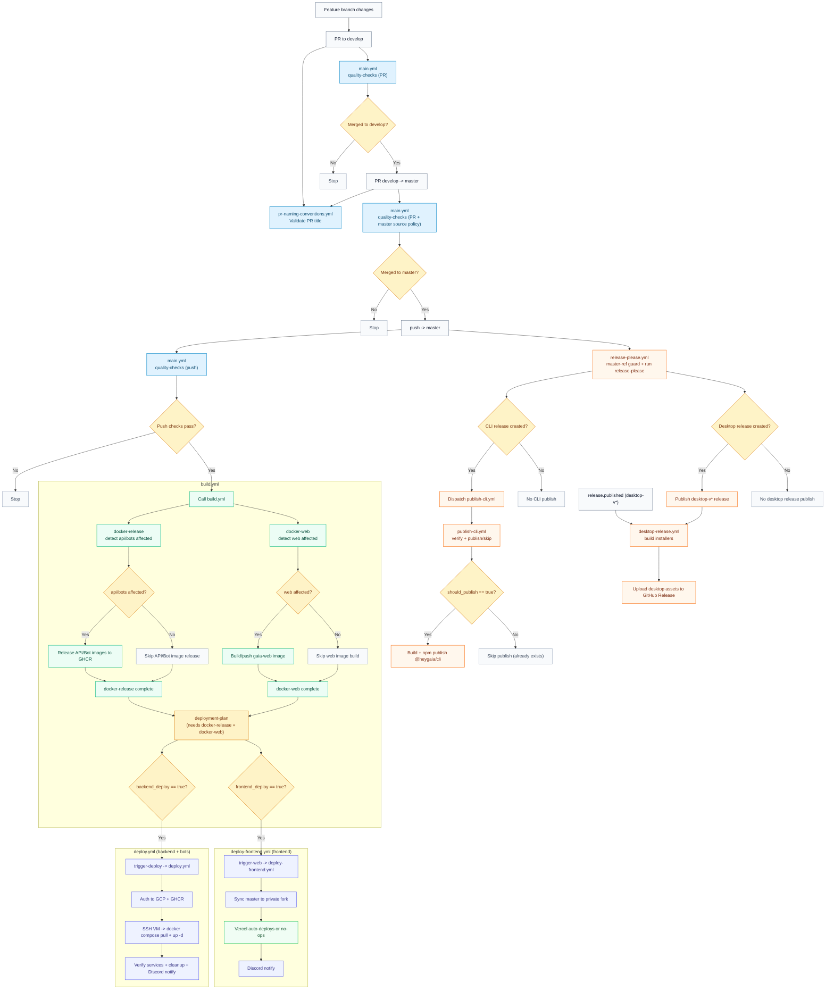

# CI and Deployment Flow

> IMPORTANT FOR AGENTS: If any workflow trigger, job dependency, deploy condition, workflow dispatch wiring, or release path changes in `.github/workflows/`, update this file in the same PR.

## End-to-End Flow Diagram

## Per-Workflow Steps
### `.github/workflows/main.yml`
1. Enter from PRs targeting `develop`/`master` and pushes to `master`.
2. Run master promotion policy guard (`develop` or `release-please--*` to `master`).
3. Install toolchains and dependencies, validate release manifest, run affected quality checks.
4. If run is a successful push on `master`, call `build.yml`.

### `.github/workflows/build.yml`
1. Start two build lanes: `docker-release` and `docker-web`.
2. `docker-release`: detect affected backend/bot projects, release relevant images, optionally sync Discord commands.
3. `docker-web`: detect `web` changes and build/push web image only when affected.
4. `deployment-plan` waits for both lanes and computes `backend_deploy` / `frontend_deploy`.
5. Trigger `deploy.yml` and/or `deploy-frontend.yml` based on plan outputs.

### `.github/workflows/deploy.yml`
1. Authenticate to Google Cloud (WIF) and GHCR.
2. SSH into production VM, pull latest images, run `docker compose up -d`.
3. Verify expected services are running/healthy, then perform Docker cleanup.
4. Send deployment status to Discord.

### `.github/workflows/deploy-frontend.yml`
1. Sync `master` to the private fork used as Vercel source.
2. Vercel performs deploy/no-op based on its own change detection.
3. Send deployment status to Discord.

### `.github/workflows/release-please.yml`
1. Enforce `master` ref (manual runs on non-master fail fast).
2. Run Release Please for valid `master` executions.
3. Open/update release PRs and create component tags/releases.
4. If CLI release created, dispatch `publish-cli.yml` with resolved tag/version.
5. Desktop release tags (`desktop-v*`) later trigger `desktop-release.yml` via GitHub `release.published`.

### `.github/workflows/publish-cli.yml`
1. Accept release `tag` and `version` via workflow dispatch.
2. Verify tag/version/manifests and npm idempotency (`should_publish`).
3. If publish required: build `packages/cli` and `npm publish --provenance`.
4. If version already exists: skip safely.

### `.github/workflows/desktop-release.yml`
1. Trigger on `release.published`, then continue only for `desktop-v*` tags.
2. Set desktop package version from release tag.
3. Build installers across macOS, Windows, Linux.
4. Upload artifacts to the matching GitHub Release.

### `.github/workflows/pr-naming-conventions.yml`
1. Trigger on PR open/edit/synchronize.
2. Validate PR title against configured semantic type list.

## File Map
- `.github/workflows/main.yml`: CI quality gate and master promotion policy.
- `.github/workflows/build.yml`: image build/release lanes, deploy planning, deploy triggers.
- `.github/workflows/deploy.yml`: production backend and bot deployment to GCP VM.
- `.github/workflows/deploy-frontend.yml`: frontend sync path for Vercel source repository.
- `.github/workflows/release-please.yml`: release PR/tag automation and CLI publish dispatch.
- `.github/workflows/publish-cli.yml`: CLI package validation/build/publish workflow.
- `.github/workflows/desktop-release.yml`: desktop installer build and release-asset upload.
- `.github/workflows/pr-naming-conventions.yml`: PR title convention enforcement.
